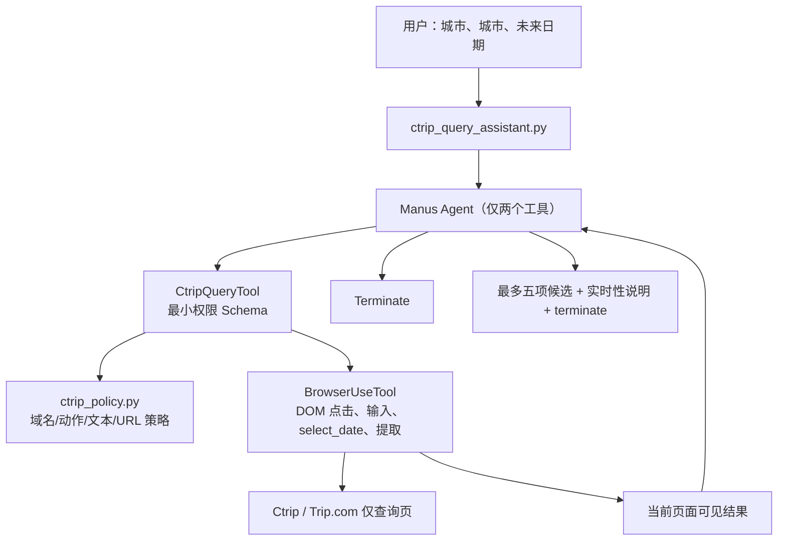

# 携程航班查询助手：案例审阅、设计与交接

> 状态：MVP 已完成离线安全验证；尚未发起本轮真实携程查询。  
> 文档更新时间：2026-09-05（Asia/Shanghai）  
> 代码根目录：`D:\It\Test_Project\Openmanus-Project\upstream\manus-gui`

## 1. 目标与边界

本项目不是无人值守购票机器人。当前 MVP 仅提供：

```text
出发城市 + 到达城市 + 未来出发日期
  -> 填写携程/Trip.com 航班查询条件
  -> 提交“查询”
  -> 读取当前可见航班候选项（最多 5 条）
  -> 结束并提示价格为实时观察
```

明确不做：登录/注册、验证码或风控处理、乘机人信息、订单页、提交订单、支付或支付页跳转。若站点要求这些流程，助手应停止并提示用户人工接管。

## 2. 老师案例的盘点结果（拒绝重复造轮子）

审阅目录：`D:\It\Test_Project\case`。

| 案例资产 | 结论 | 当前处理 |
|---|---|---|
| `OpenManus-gui` | 这是主要的携程实验项目；包含大量真实页面快照与运行日志。 | 作为经验来源，不整仓复制。 |
| `debug_html` | 共积累多轮 `www.ctrip.com`、`flights.ctrip.com` HTML；最后一批可确认到达上海→北京单程结果页。 | 选取一份结果页作为离线回归 fixture。 |
| `test_date_picker.py` / `analyze_date_picker.py` | 证明日期选择器是动态 DOM 难点，脚本通过 DOM 索引和快照定位问题。 | 当前上游已有更通用的 `select_date`，直接复用。 |
| `test_*vision*` / `test_*gui*` | 使用 GUI-Plus/坐标/视觉路径尝试城市输入、日期、搜索。 | 不在本 MVP 使用：历史记录有 JSON 格式错误、遮罩拦截和页面超时；且坐标点击不适合受限查询场景。 |
| 运行日志 | 历史上至少有成功抵达 `https://flights.ctrip.com/online/list/oneway-sha-bjs?...&depdate=2026-01-30` 的记录。 | 作为可达性历史证据，不把历史票价当成实时数据。 |

### 从日志提炼出的故障模式

1. `Page.goto` 可能出现 30 秒超时：必须把它记录为可恢复的站点加载问题，而非无限重试。
2. 首页营销元素曾拦截点击：优先用 DOM/语义定位与 `close_popup` 思路，而不是硬编码屏幕坐标。
3. 视觉模型曾返回非法 JSON（含重复键）及“未知原因”失败：不能把 GUI/视觉作为查询主路径。
4. 日期控件动态渲染、元素索引会变化：使用 `select_date` 的属性/文本定位和 JS 回退；不要采用老师案例中的固定索引 `39` 或固定坐标。
5. HTML 快照内容很大且结构会随站点更新：保留小而明确的离线 fixture，只作冒烟/解析回归，不把 CSS 选择器冻结为生产契约。

## 3. 当前实现架构



### 关键设计决定

- **最小权限工具面**：`CtripQueryTool` 对大模型只公开查询需要的动作；不公开 `gui_action`、`open_tab`、`web_search`、`upload_file`、`paste_image` 和任意 `execute_js`。
- **双层策略**：包装器先验证；下游 `BrowserUseTool(ctrip_query_mode=True)` 在初始化前与拿到当前 URL 后再次验证。
- **点击前拦截**：点击动作会读取目标 DOM 元素的文本/属性/XPath。若明显包含登录、预订、下单、订单、支付、乘机人等字样，就拒绝点击，避免“点进去以后才发现”。
- **域名范围**：仅 `ctrip.com` / `trip.com` 及其子域名。
- **日期策略**：复用已有 `select_date`，不复用案例里的坐标或固定元素索引。
- **RAG 的职责**：课程知识库继续服务于 OpenManus 的搭建/排错；实时航班信息只来自当前网页，不应写入长期知识库。

## 4. 已写入的代码与测试

| 文件 | 作用 |
|---|---|
| `app/ctrip_policy.py` | 允许域名、允许动作、敏感 URL/文本拒绝规则。 |
| `app/tool/ctrip_query_tool.py` | 新增最小权限包装器；保持工具名 `browser_use`，以兼容 Manus 的页面状态提示。 |
| `ctrip_query_assistant.py` | 专用 CLI；运行时将 Manus 宽泛工具集替换为 `CtripQueryTool + Terminate`。 |
| `tests/test_ctrip_policy.py` | 策略单元测试。 |
| `tests/test_ctrip_query_tool.py` | Schema 最小化与“浏览器初始化之前拦截”测试。 |
| `tests/fixtures/ctrip/legacy_sha_bjs_result_20260121.html` | 从老师案例复制的**历史**上海→北京结果页快照。 |
| `tests/fixtures/ctrip/manifest.json` | fixture 来源、日期和 SHA-256。 |
| `tests/test_ctrip_legacy_fixture.py` | 离线快照的基本可读性回归。 |

## 5. 本轮验证记录

### 通过

```powershell
cd D:\It\Test_Project\Openmanus-Project\upstream\manus-gui
.\.venv\Scripts\python.exe -m py_compile `
  app\ctrip_policy.py app\tool\ctrip_query_tool.py ctrip_query_assistant.py

.\.venv\Scripts\python.exe -m pytest -q `
  tests\test_ctrip_policy.py `
  tests\test_ctrip_query_tool.py `
  tests\test_ctrip_legacy_fixture.py
```

结果：**9 passed**。环境仍有 Pydantic 旧式配置 warning，但没有影响本 MVP 测试结果。

### 本轮发现并已处理的问题

| 问题 | 处理 |
|---|---|
| 测试环境没有 `pytest-asyncio`，直接声明 `async def test_*` 会失败。 | 用标准库 `asyncio.run()` 包裹策略测试，避免增加不必要依赖。 |
| 初版 wrapper 仍公开 `execute_js`，无法从 Schema 证明脚本只读。 | 从模型可见 Schema 移除 `execute_js`。 |
| 只按 URL 拦截，可能先点击“预订/下单”再跳转。 | 增加点击前 DOM 文本/属性/XPath 检查。 |
| `send_keys` 的敏感文本没有纳入策略文本检查。 | wrapper 将 `send_keys` 的 `keys` 传给策略检测，覆盖“支付”等敏感输入。 |
| 一次 PowerShell 替换把文本 `` `n `` 写入 Python 源文件造成 SyntaxError。 | 立即修复，最终 `py_compile` 和全部测试通过；后续优先用 Python `Path.write_text` 或完整文件写入。 |

## 6. 运行方式（真实查询前提）

在同一 PowerShell 会话中安全设置 API Key，**不要**把 Key 写入 `config.toml` 或聊天消息：

```powershell
$env:DASHSCOPE_API_KEY = '你的新密钥'
$env:PYTHONIOENCODING = 'utf-8'

cd D:\It\Test_Project\Openmanus-Project\upstream\manus-gui
.\.venv\Scripts\python.exe .\ctrip_query_assistant.py `
  --origin 上海 `
  --destination 北京 `
  --date 2026-09-25 `
  --max-steps 12
```

`2026-09-25` 相对于文档日期 `2026-09-05` 是未来日期，仅为示例。真实运行前应改为用户明确给出的未来日期。

若页面要求登录、验证码、风控、预订、订单或支付，正确结果是停止并报告，**不尝试绕过**。

## 7. 后续 Agent 交接清单

1. 先读取本文件，再执行 `git status --short`，不要覆盖现有的 RAG 和上游兼容性修改。
2. 做真实查询前，收集且只收集：出发城市、到达城市、未来日期；不要询问身份证、乘机人、支付或 API Key。
3. 先跑第 5 节的离线回归测试；任何变更后都必须再次执行。
4. 若真实站点加载超时：记录 URL、时间、错误摘要；至多进行一次短等待/重新加载。不要高频重试，不要改变浏览器指纹或规避风控。
5. 若城市输入 DOM 不稳定：优先增强文本/语义定位或站点允许的官方接口；不要恢复固定坐标点击。
6. 若需要“人工接管”：下一阶段应是用户自己启动且登录的浏览器会话并通过 CDP 接入，助手只协助查询/整理，并继续停在下单前。该方式不用于规避检测。
7. 票价、库存、航班必须声明为实时网页观察；历史 fixture 绝不能当作实时数据或训练事实。

## 8. 迭代路线

```text
MVP-0（当前）：单程查询 -> 最多 5 条候选 -> 停止
MVP-1：规范化候选项（航司、时刻、时长、价格、链接/页面状态）
MVP-2：用户授权的人工接管与偏好过滤（仍停在订单前）
MVP-3：只在平台明确授权/API 可用时研究订单准备；支付永远由用户完成
```

## 9. GUI/视觉能力的接入原则（2026-09-05）

老师案例证明了 GUI-Plus 可以分析携程截图，但也暴露了坐标漂移、遮罩拦截、非法 JSON 和未知失败。因此当前设计采用：

```text
DOM / select_date / 页面文本提取
  -> 首选路径
视觉模型（gui-plus）
  -> 只做看图、识别候选控件、必要时由用户确认
  -> 不用于验证码、风控绕过、支付或订单操作
```

`gui-plus` 已登记为支持图像输入的模型。它与 `qwen3.7-flash` 使用同一 DashScope Key，不需要在 `.env` 增加第二个 Key；只有当用户另购了不同供应商的视觉模型时，才需要额外配置对应的 LLM 段和凭据。

注意：把 GUI 模型加入多模态模型列表，只表示模型可以接收截图，不等于自动开放坐标点击。CtripQueryTool 仍不公开 `gui_action`，以避免模型在站点防护页上盲目点击。后续若加入视觉后备，应拆成只读 `vision_inspect`，输出控件描述/坐标供用户确认，而不是直接执行鼠标动作。
